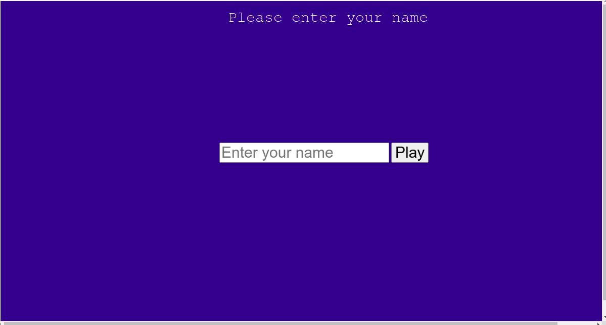
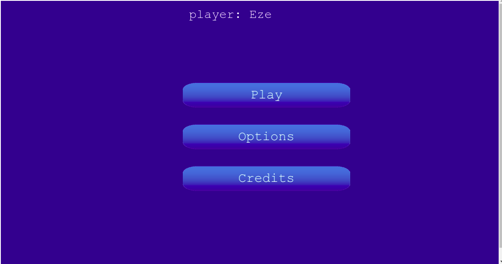
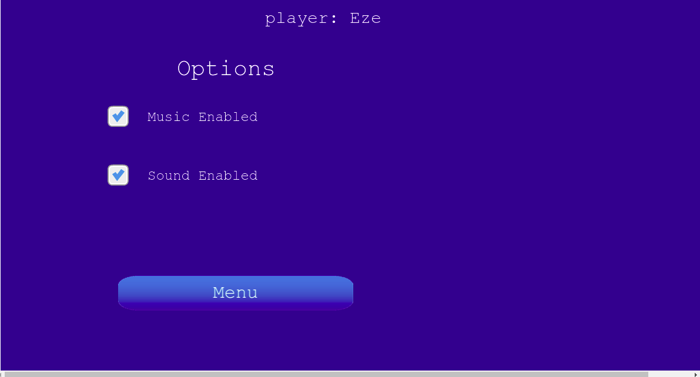
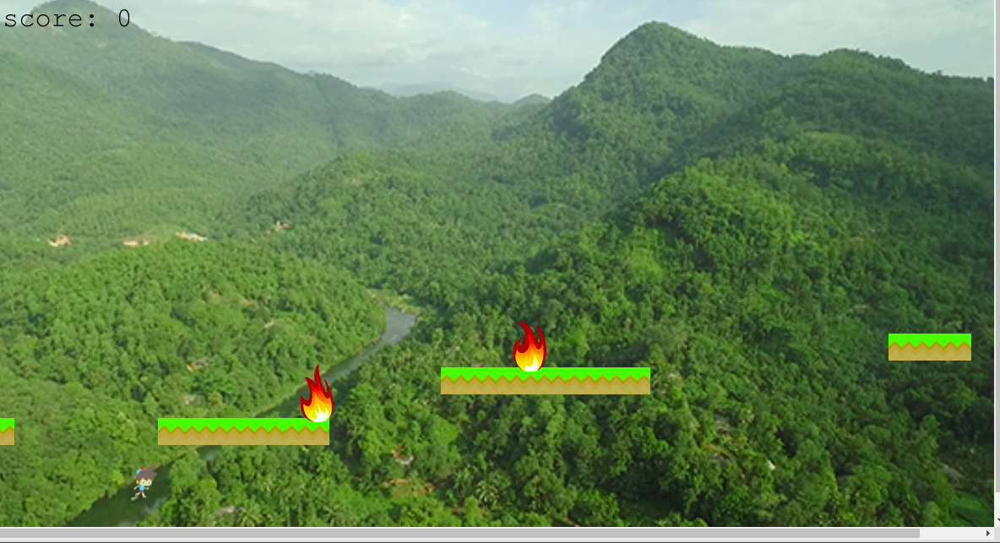

# Platform-game Overview

This project is to build a platform game - a type of endless runner game. I envisaged a platform where an individual will keep running on the platform continuously. It is assumed to be a type of military training ground. The platform has some broken parts and a ditch below it. When the individual or player gets to that broken part, he jumps over to the next platform. If he could not jump on time or did not jump at all, he falls into the ditch and that is the end of the game. If he succeeds in jumping, he continues the run. In the process of running, valuable items in the form of coins appear for him to pick. If he succeeded in collecting the coins, his score is incremented. On the order hand, there is danger in the form of fire that appears from time to time. This runner is expected to dodge the fire danger. If the player fails to dodge the fire, he would be consumed and that marks the end of the game.

## Preview

## Login Page


## Game Option Display


## Select Game Option


## Playing Game


## Features 
- Player can log in to the game using his name
- Runner can jump ditches
- Runner can collect coins
- Runner can dodge fire danger
- Background sound and music can be enabled or disabled.
- Score are displayed at the end of game
- Menu options are displayed to allow player make choice.
- Webpack compiles ES6 JavaScript code

## Project SetUp

Get a local copy of the file. Clone with HTTPS using the command below.

```
git clone https://github.com/Zubenna/my-todo-list-app.git
```
## Access project folders 
```
cd my-todo-list-app, then, cd dist.
```
- Click on index.html to display the application on the browser.
- Text all application features.

## Testing With Jest
The folder modules in the src folder contains all the tests written for this project. Functions in the addGroupName.js and manageTasks.js are tested using two different test files. The testing framework used is Jest. About 29 different tests have been written for this project by mocking the actual implementation. You can run the test at the root of the project by opening the command prompt and typing the command below:
```
 npm run test
``` 
## Live Version
- [Launch App](https://zubenna.github.io/my-todo-list-app/)

## Built With
- JavaScript
- Webpack
- HTML
- CSS
- Bootstrap 4
- Jest for testing

## Author

👤 **Nnamdi Emelu**
- Github: [@zubenna](https://github.com/zubenna)
- Twitter: [@zubenna](https://twitter.com/zubenna)
- Linkedin: [nnamdi-emelu](https://www.linkedin.com/in/nnamdi-emelu/)

##  Contributing

Contributions, issues, and feature requests are welcome!

Feel free to check the [issues page](https://github.com/Zubenna/my-todo-list-app/issues)

## Show your support

Give a star if you like this project!

## Acknowledgments
- Project originally taken from The Odin Project
- Project inspired by Microverse Program