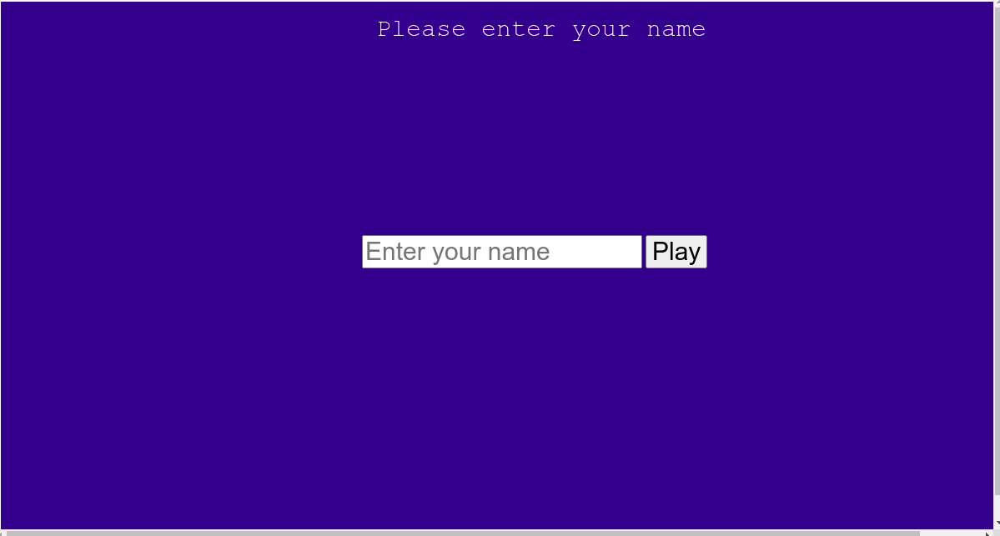
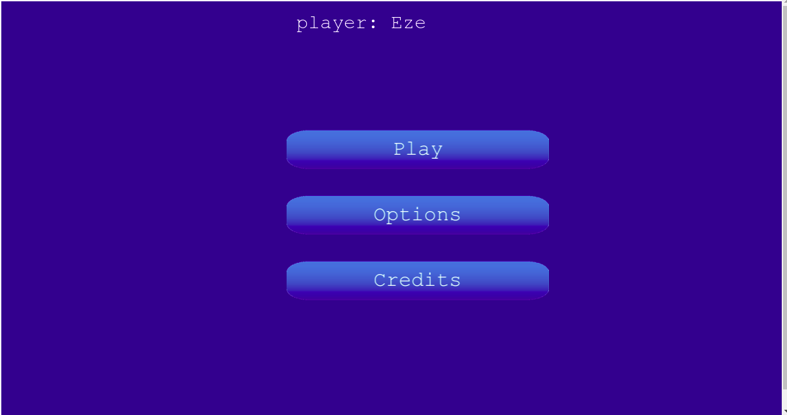
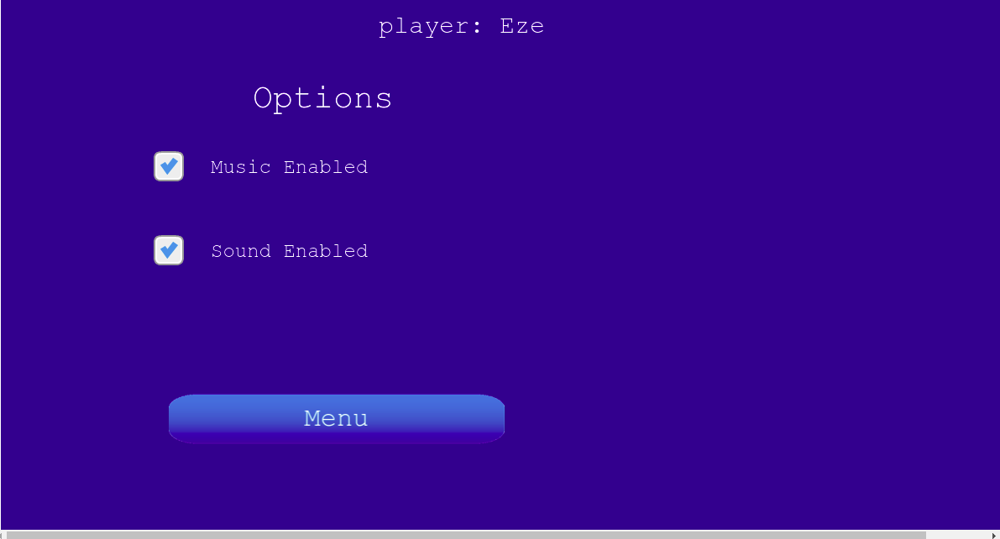
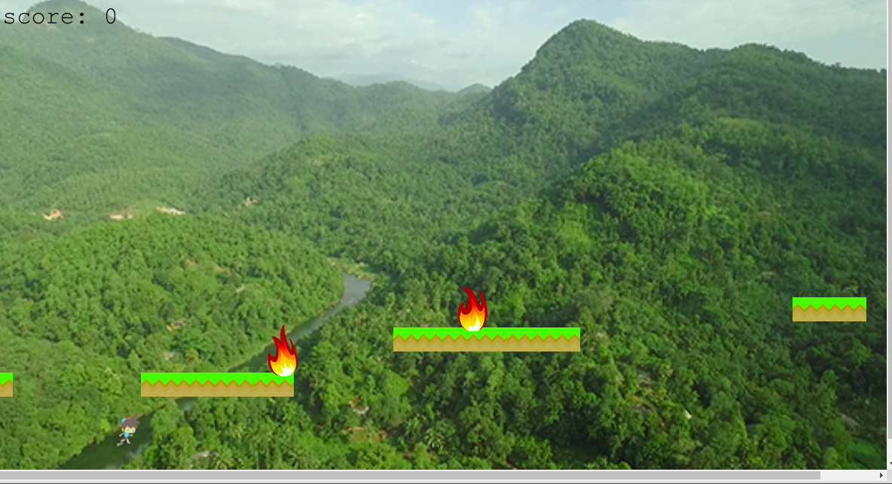

# Platform-game Overview

This project is to build a platform game - a type of endless runner game. I envisaged a platform where an individual will keep running on the platform continuously. It is assumed to be a type of military training ground. The platform has some broken parts and a ditch below it. When the individual or player gets to that broken part, he jumps over to the next platform. If he could not jump on time or did not jump at all, he falls into the ditch and that is the end of the game. If he succeeds in jumping, he continues the run. In the process of running, valuable items in the form of coins appear for him to pick. If he succeeded in collecting the coins, his score is incremented. On the order hand, there is danger in the form of fire that appears from time to time. This runner is expected to dodge the fire danger. If the player fails to dodge the fire, he would be consumed and that marks the end of the game.

## Game Design Document (GDD)
The GDD can be found [here](docs/GDD.md)

## Preview

## Login Page


## Game Option Display


## Select Game Option


## Playing Game


## Features 
- Player can log in to the game using his name
- Runner can jump ditches
- Runner can collect coins
- Runner can dodge fire danger
- Background sound and music can be enabled or disabled.
- Score is displayed at the end of the game
- Menu options are displayed to allow players to make choices.
- Webpack compiles ES6 JavaScript code

## Project SetUp

Get a local copy of the file. Clone with HTTPS following the steps below.
### For Windows
- In your search box, type cmd, click on cmd to open the command prompt.
### For Linux, Mac OS
- In your search box, type terminal, click on the terminal to launch it.

- Copy and paste the command below in your terminal and press enter from your keyboard.
```
git clone https://github.com/Zubenna/platform-game.git
```
## Access Project Folders 
- Depending on where the game files are downloaded to, either Hard Disk(HDD), Desktop or Documents directory in your computer after completing the step above.
- Click on the folder platform-game to open it.
- Inside the folder, right-click and click on terminal or cmd depending on your Operating System to open it.

## Set Up Game Locally in Your Computer
- In the cmd or terminal, type the command below;
```
npm install
```
- Wait for some time to install all the game packages.
- Once the installation is completed, you will see messages like '23 packages has been added, 'audited 1335 packages in 37.888s' etc.

- Now, type the command below in your cmd or terminal to start the game server. Wait for some time.
```
npm run start
```
- Once the server is fully started, you will see the message 'webpack: Compiled successfully' at the end. At this time the game server is fully running and the game is ready to be played. The game interface might be loaded automatically this time, If not follow the next step.
- In your browser, Chrome, Mozilla Firefox, etc., copy and paste the URL below into your browser address bar and press enters from your keyboard.
```
http://localhost:8000/
```
- The game interface is loaded and the Login page is displayed as shown in the picture above.
- Enter your name and press enter. The game options screen is displayed as shown in the second picture above.
    - Click Play to play the game.
    - Click Options to enable or disable sound and background music.
    - Click Credits to see the name of the developer.
- If Play is clicked, the game playing environment as shown in the last picture above is displayed and you can start playing the game.
## Game Summary
>This is an endless runner game where players run over some platforms and jump from one platform to another.
>The burning fires are presented as obstacles that must be dodged to continue the game.
>some coins can be collected to increase the score.  
>The game ends once the user falls down the platform or gets burned by the fire.

## How To Play
```
The rules are simple
1. Click once to jump over to another platform while running.
2. Click twice for a double jump.
3. Press down the mouse to maintain a steady jump.
4. Jump and dodge the fire to stay alive.
5. Jump on the platforms and do not fall.
6. Collect the coins to increase your score.
7. Once the game is over, the score is displayed.

```
## Testing With Jest
The test folder is in the src folder. It contains all the tests written for this project. Functions in different scenes are tested using various test files. The testing framework used is Jest. About 16 different tests have been written for this project by mocking the actual implementation. You can run the test at the root of the project by opening the command prompt or terminal and typing the command below:
```
 npm run test
``` 
## Live Version
Play game online by clicking 'Launch Game' as shown below.
- [Launch Game](https://stormy-gorge-01657.herokuapp.com/)

## Built With
- JavaScript
- Webpack
- HTML5, CSS3
- Phaser 3
- Leaderboard API
- Jest for testing

## Author

👤 **Nnamdi Emelu**
- Github: [zubenna](https://github.com/zubenna)
- Twitter: [@zubenna](https://twitter.com/zubenna)
- Linkedin: [nnamdi-emelu](https://www.linkedin.com/in/nnamdi-emelu/)

## 🤝 Contributing

Contributions, issues, and feature requests are welcome!

Feel free to check the [issues page](https://github.com/Zubenna/platform-game/issues)

## 👍 Show Your Support
Kindly star ⭐️ this project, if you like it!

## :clap: Acknowledgements

- [Microverse](https://www.microverse.org/)
- [Phaser](https://phaser.io/)
- [OpenGameArt](https://opengameart.org/)
- [Game Art 2D](https://www.gameart2d.com/freebies.html)

## 📝 License

This project is [MIT](./LICENSE) licensed.